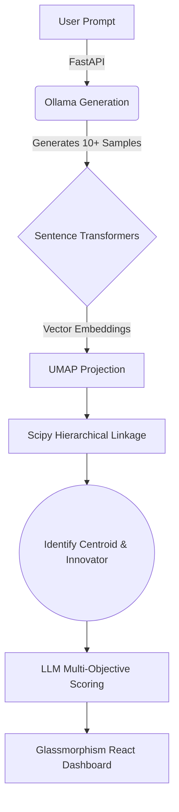

# 🌌 Consensus Sampling Pipeline
### Visualized Emergent Reasoning Engine

*Harnessing multi-objective geometric AI consensus.*

---

## 📖 Overview

The **Consensus Sampling Pipeline** is an advanced AI research tool designed to extract the most mathematically aligned answers from Local LLMs. It prompts a local model (via Ollama) to generate multiple diverse outputs for a single complex prompt, embeds them into a semantic vector space, and calculates the true geometric alignment of those ideas.

With a **Premium Glassmorphism Dark Mode UI**, you can visually explore the topological projection of thoughts, examining both the **Centroid** (most consensus-aligned) and the **Innovator** (coherent outlier) of the generations.

---

## ✨ Key Features

- 🧠 **Emergent Reasoning**: Generates diverse parallel thoughts to combat AI hallucination and find genuine consensus.
- 📐 **Semantic Geometry**: Projects text outputs into semantic vector space using `sentence-transformers` and `UMAP` for accurate non-linear topological projection.
- 🎯 **Multi-Objective Scoring**: Evaluates top centroids and outliers on Reasoning, Factuality, Coherence, and Novelty using the LLM itself as a qualitative judge.
- 🛡️ **Stability Metrics**: Uses stability scores, density variations, outlier distances, and plateau detection to filter corrupted embeddings or bloated outputs.
- 🎨 **Stunning Visualization**: A beautiful React + Vite frontend dashboard mapping the vector space and hierarchical linkage heatmaps of ideological blocks.

---

## 🛠️ Tech Stack

**Backend Engine:**
- `Python 3.12+`
- `FastAPI` & `Uvicorn`
- `Ollama` (Local LLM Orchestration)
- `Sentence-Transformers` (Semantic Embedding)
- `UMAP-learn` (Topological Projection)
- `Scikit-learn` & `Scipy` (Clustering and Linkage)

**Frontend Dashboard:**
- `React 19`
- `Vite`
- `Vanilla CSS` (Premium Glassmorphism & Micro-animations)
- `Lucide-React` (Icons)

---

## 🚀 Getting Started

### Prerequisites
Before running the pipeline, ensure you have the following installed on your system:
1. **[Python 3.12+](https://www.python.org/downloads/)**
2. **[Node.js (v18+)](https://nodejs.org/)**
3. **[Ollama](https://ollama.ai/)** (Must be installed and running in the background)
   - *Recommendation: Pull your preferred model (e.g., `ollama run mistral` or `ollama run llama3`) before starting.*

### Installation & Execution (Windows)

We've bundled everything into a single, seamless start script. 

1. Clone or download this repository.
2. Navigate to the root folder: `Iterative-AI-Optimization`
3. Double-click the `start.bat` file.

The script will automatically:
- Create terminal instances for both the frontend and backend.
- Install backend `pip` dependencies from `requirements.txt`.
- Install frontend `npm` dependencies.
- Launch the FastAPI server on `http://localhost:8000`.
- Launch the React Vite dashboard.

Once you see the terminal output `ready in ... ms`, navigate to:
**👉 [http://localhost:5173](http://localhost:5173)** in your web browser.

---

## 🧩 Architecture

---

## 🧪 Advanced Experimentation

For researchers, the repository includes `batch_experiment.py`. This script allows you to run controlled 1:1 geometry tests across different models (e.g., Mistral vs Llama3) with complex, highly abstract prompts to gather raw JSON outputs in the `queries/` directory.

---

<i>Built for pushing the boundaries of local AI capabilities.</i>

